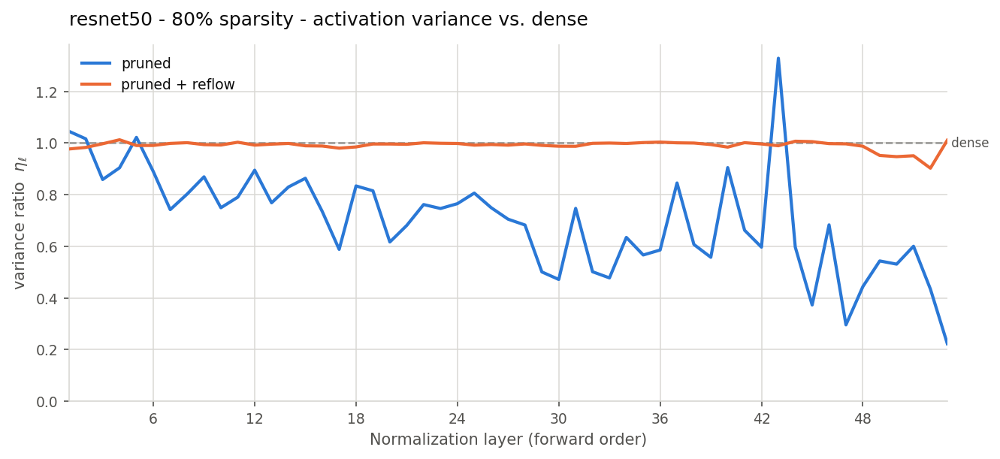

# ReFlow: CNNs and Vision Transformers

Restoring signal variance in one-shot pruned vision models.

One-shot magnitude pruning shrinks the variance of every layer's
pre-normalization activations, but the BatchNorm layers keep dividing by the
statistics of the *dense* model. The activations are over-normalized, and since
each layer feeds the next, the shortfall compounds with depth — deep layers end
up with almost no variance, distinct inputs map to near-identical
representations, and accuracy collapses.

**Reflow fixes the normalizer instead of retraining the weights**: it recomputes
each BatchNorm's running mean/var from the pruned model's own activations over a
few dozen forward passes. No gradients, no weight updates, tens of seconds. For
LayerNorm models, which store no such statistics, it fits the LayerNorm affine
parameters instead — same idea, different mechanics
([details](#reflow-bn-vs-reflow-ln)).

Measured on the full evaluation split, 50 calibration batches, one-shot global
magnitude pruning:

| model | sparsity | dense | pruned | + reflow |
|---|---|---|---|---|
| ResNeXt-101 32x8d (ImageNet) | 80% | 82.44% | 0.60% | **77.92%** |
| ResNet-50 (ImageNet) | 80% | 76.13% | 3.31% | **54.18%** |
| ResNet-20 (CIFAR-10) | 90% | 91.43% | 10.23% | **47.83%** |
| ViT-B/16 (ImageNet)&nbsp;† | 70% | 81.07% | 1.09% | **57.90%** |

† ViT takes the LayerNorm route, which works differently and uses a larger
calibration budget (500 batches) — see
[ReFlow-BN vs ReFlow-LN](#reflow-bn-vs-reflow-ln).



Pruned ResNet-50 (blue) decays from η ≈ 1.05 at the first BatchNorm to 0.223 at
the last — that decay *is* the accuracy collapse. After reflow (orange) every
layer sits back on 1.0 (median 0.996).

---

## Requirements

A CUDA GPU is expected (CPU works but a full ImageNet pass is impractically
slow). Developed and tested on Python 3.9 with:

| package | tested version |
|---|---|
| `torch` | 2.5.1 (CUDA 12.4) |
| `torchvision` | 0.20.1 |
| `numpy` | 2.0.2 |
| `matplotlib` | 3.9.4 |
| `tqdm` | 4.67.1 |

Nothing here is version-fragile — `torch>=2.0` with a matching `torchvision`
should be fine. The pinned versions are what the numbers above were produced on.

## Install

With conda (recommended, since torch is easiest to get this way):

```bash
conda env create -f environment.yml
conda activate reflow
pip install -e .
```

Or into an existing environment:

```bash
pip install -e .          # pulls torch, torchvision, numpy, matplotlib, tqdm
```

Either way `pip install -e .` puts the `reflow` command on your PATH. Without
installing, `python -m reflow.cli ...` is equivalent from the repo root.

Verify:

```bash
reflow --list-models
```

## Data

Neither dataset is downloaded for you — both are local copies you point the
library at:

- **ImageNet** — a standard ImageFolder tree with `train/` and `val/`
  subfolders, each containing one directory per class.
- **CIFAR-10** — a torchvision download root holding `cifar-10-batches-py/`
  (i.e. what `torchvision.datasets.CIFAR10(..., download=True)` produces).

Three ways to say where they are, in precedence order:

```bash
reflow --model resnet50 --data-path /data/imagenet     # per run
export REFLOW_IMAGENET=/data/imagenet                  # per machine
export REFLOW_CIFAR10=/data/cifar10
```

...or edit `DATASETS` in [`reflow/data.py`](reflow/data.py) for a permanent
default. The checked-in defaults are the paths on the machine this was developed
on and will not exist on yours.

## Model weights

The five ImageNet CNNs download their pretrained weights from torchvision on
first use — nothing to set up.

`resnet20` and `mobilenet` load from local checkpoints (`chita_trained_resnet20.pt`
and `trained_MobileNetExplicit.pt`) that are **not distributed with this repo**.
Put them in the repo root, or set `REFLOW_CHECKPOINTS` to the directory holding
them. Without those files those two models raise a clear error; the rest work
regardless.

## Command line

```bash
reflow --model resnet50 --dataset imagenet --sparsity 0.8 --plot
```

Measures top-1 accuracy at three stages — dense, pruned, pruned + reflow — and
writes `results.json` to `results/<experiment-name>/`:

```
====================================================
resnext101  |  imagenet  |  80.0% sparse
----------------------------------------------------
  dense                   82.44%
  pruned                   0.60%
  pruned + reflow         77.92%
----------------------------------------------------
  recovered by reflow    +77.32 points
====================================================
```

`--plot` additionally measures the per-layer variance ratio

&nbsp;&nbsp;&nbsp;&nbsp;η_ℓ = Var_pruned(Z_ℓ) / Var_dense(Z_ℓ)

and renders `variance_ratio.png` (the pruned curve decaying with depth, the
reflowed one back near 1.0) and `accuracy.png`. Use `--variance` to record the
ratios in `results.json` without rendering figures.

Useful flags:

| flag | meaning |
|---|---|
| `--sparsity` | fraction of prunable weights removed (default `0.8`) |
| `--pruning` | `global` magnitude ranking across the network, or `layerwise` |
| `--calibration-batches` | batches reflow consumes (default 50 for BatchNorm, 500 for LayerNorm) |
| `--lr` | Adam learning rate for LayerNorm calibration; ignored by BatchNorm models |
| `--variance-batches` | batches used to measure activation variance (default 16) |
| `--limit-batches` | cap every accuracy measurement — smoke runs only |
| `--batch-size`, `--num-workers`, `--device`, `--seed` | the usual |
| `--output-dir`, `--experiment-name` | where results land |
| `--list-models` | print the model table and exit |

A fast end-to-end check that needs no ImageNet, if you have CIFAR-10:

```bash
reflow --model resnet20 --sparsity 0.9 --plot
```

## Models

| name | dataset | published top-1 | weights |
|---|---|---|---|
| `resnet20` | CIFAR-10 | — | local checkpoint |
| `mobilenet` | ImageNet | — | local checkpoint |
| `resnet50` | ImageNet | 76.13% | torchvision |
| `resnet101` | ImageNet | 77.37% | torchvision |
| `resnet152` | ImageNet | 78.31% | torchvision |
| `regnet_x_32gf` | ImageNet | 80.62% | torchvision |
| `resnext101` | ImageNet | 82.83% | torchvision |
| `vit_b_16` | ImageNet | 81.07% | torchvision |
| `vit_l_32` | ImageNet | 76.97% | torchvision |

`--dataset` defaults to the one a model was trained on, so it only needs
spelling out when you want it in the run name. torchvision weight enums are
pinned per model rather than tracking `DEFAULT`, so the dense baseline is
reproducible — the CLI prints the published top-1 next to the measured one, and
a large gap means the data path or transforms are wrong.

## ReFlow-BN vs ReFlow-LN

Both strategies are implemented, and `reflow()` picks between them by inspecting
the model — there is no flag to get wrong.

The failure being repaired is the same in both cases: pruning shrinks activation
variance, the normalizer does not know, the shortfall compounds with depth. What
differs is whether the normalizer *stores* anything you can correct.

**ReFlow-BN** (`resnet*`, `regnet*`, `resnext*`, `mobilenet`). BatchNorm keeps
`running_mean` and `running_var` buffers, frozen at inference and inherited from
the dense model. Those buffers are simply wrong for the pruned network, so
reflow overwrites them with statistics measured from the pruned network's own
activations. Post-BN variance then returns to γ² by construction — one shot,
exactly, no search.

**ReFlow-LN** (`vit_b_16`, `vit_l_32`). LayerNorm computes its mean and variance
per sample at run time, so there are no stale buffers to overwrite —
normalization is already "correct" for whatever it is handed. The only
persistent handles on scale are the affine parameters γ and β, and there is no
closed form for what they should become, so they have to be *fitted*.

|  | ReFlow-BN | ReFlow-LN |
|---|---|---|
| architectures | BatchNorm CNNs | LayerNorm transformers (ViT) |
| what it changes | `running_mean` / `running_var` **buffers** | LayerNorm **parameters** γ, β |
| model weights | untouched | untouched (everything but LN is frozen) |
| mechanism | measure statistics, overwrite | minimize cross-entropy with Adam |
| gradients | none | forward **and** backward |
| calibration data | unlabeled inputs | **labeled** examples |
| convergence | exact, ~50 forward passes, seconds | iterative, ~500 steps, minutes |
| tuning knobs | none | `--lr` (Adam, default `1e-3`) |
| `--calibration-batches` default | 50 | 500 |

The last two rows are the practical difference. ReFlow-BN is an estimator: 50
batches gives you the answer and more batches change nothing. ReFlow-LN is an
optimization, so an undersized budget underperforms silently rather than
failing — on ViT-B/16 at 70% sparsity the full 500 batches recover 57.90%,
while a 60-batch run of the same model reached only ~11% (measured on a 5k-image
subset). If a ViT run disappoints, raise `--calibration-batches` before
concluding anything about the method.

Both are training-free in the sense that matters for pruning — no model weight
is updated — but only ReFlow-BN is gradient-free.

## Library

```python
from reflow import (
    load_model, load_dataset, evaluate, prune_model,
    cache_batches, reflow, collect_activation_variance, variance_ratios,
)

model, spec = load_model("resnet50", device="cuda")
calibration, test = load_dataset(spec.dataset, batch_size=128)

dense_acc = evaluate(model, test, "cuda")
prune_model(model, 0.8)                       # one-shot global magnitude pruning
pruned_acc = evaluate(model, test, "cuda")

batches = cache_batches(calibration, 50)
reflow(model, batches, "cuda")                # recompute BatchNorm statistics
reflow_acc = evaluate(model, test, "cuda")
```

Or the whole thing in one call:

```python
from reflow import run_experiment
result = run_experiment("resnet50", target_sparsity=0.8, measure_variance=True)
print(result.accuracy, result.recovered)
print(result.variance_ratios["pruned"]["output"])   # eta per layer, forward order
```

[`Reflow_CNNs.ipynb`](Reflow_CNNs.ipynb) walks the same run stage by stage with
the intermediate models left open for inspection.

## Layout

```
reflow/
  models.py         model registry -> load_model()
  data.py           dataset registry -> load_dataset()
  pruning.py        one-shot magnitude pruning, sparsity, masks
  calibration.py    reflow: BatchNorm statistics, or LayerNorm affine
  signal.py         per-layer activation variance and eta ratios
  evaluation.py     top-1 accuracy
  plotting.py       variance-ratio and accuracy figures
  pipeline.py       run_experiment(): the three stages end to end
  cli.py            the `reflow` command
  architectures/    MobileNetV1 and ResNet-20 definitions for the local checkpoints
```

The classes in `architectures/` match the pickled layout of the two local
checkpoints exactly — renaming an attribute or folding blocks into
`nn.Sequential` breaks loading.

## Reading the variance ratio

η_ℓ is measured on identical cached batches replayed through the dense, pruned
and reflowed models, so the three curves are directly comparable. Two things are
worth knowing when interpreting a run:

- **Reflow lands near 1.0, sometimes above it.** ResNet-50 comes back to a
  median η of 0.996; ResNeXt-101 settles at 1.383. Overshoot is expected rather
  than a fault: after reflow, post-BN variance is γ² by construction, while the
  dense reference divides by running statistics accumulated during training,
  which need not match dense activations on the calibration batches. The
  denominator, not the numerator, is what drifts.
- **It is the same measurement for both strategies.** On ViT-B/16 the LayerNorm
  outputs decay to a median η of 0.612 under pruning and come back to 0.986
  after calibration — the same curve shape as the CNNs, which is the evidence
  that ReFlow-BN and ReFlow-LN are treating one phenomenon by two routes.
- **The last stage of some networks inflates rather than decays.** ResNeXt-101's
  `layer4` runs η > 1 even before reflow (3.888 at the final layer), so the
  final-layer value alone would read as though reflow made things worse. That is
  why the summary reports the median over layers as well — the median is the
  robust read of whether the signal collapsed.
